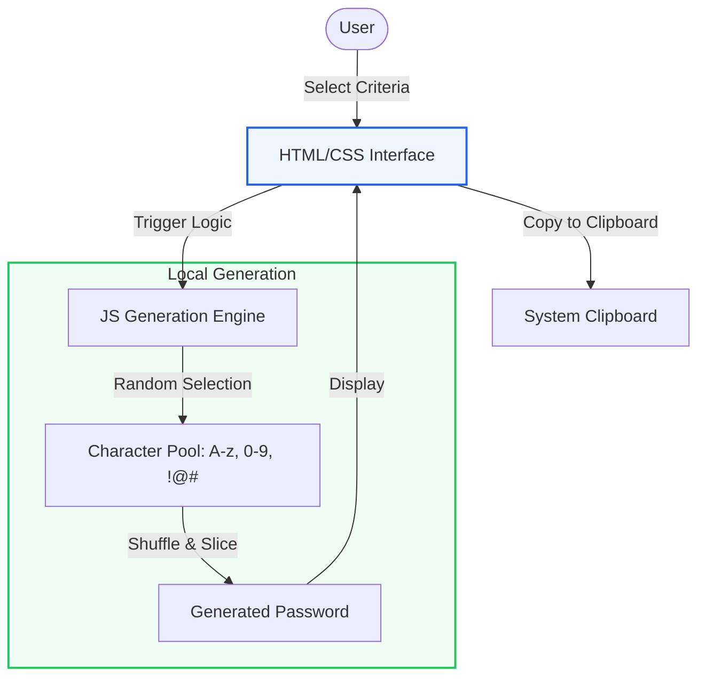

# 🔐 Advanced Password Generator
A lightweight, secure, and highly customizable vanilla web utility designed to generate cryptographically strong passwords instantly.

## 📝 Overview
The Advanced Password Generator provides a sleek, user-friendly interface for creating high-entropy passwords. Built with vanilla JavaScript, it allows users to toggle character sets (uppercase, lowercase, numbers, symbols) and adjust length dynamically, ensuring maximum security for digital accounts without any server-side data storage.

## ✨ Key Features
- **Entropy Control**: Real-time password generation based on user-defined length and complexity filters.
- **Instant Clipboard Integration**: Seamless one-click copying of generated strings to the system clipboard.
- **Security First**: All generation logic happens locally on the client-side, ensuring no sensitive data ever hits a network.
- **Responsive Glassmorphic UI**: A modern, tactile design that scales perfectly across mobile and desktop devices.

## 🛠 Tech Stack
- Frontend: `HTML5`
- Styling: `Vanilla CSS3`
- Logic: `ES6 JavaScript`

## 🏗 System Architecture

The tool operates entirely on the client-side, utilizing cryptographically secure logic to ensure user privacy.



## 📂 File Structure
```text
password-generator/
├── index.html     # Semantic structure and glassmorphic layout
├── style.css      # Custom CSS3 variables and layout logic
├── script.js      # Core entropy logic and clipboard handlers
└── README.md      # Project documentation
```

## 🚀 Getting Started
This application is a standalone frontend tool. No installation is required.

```bash
# Clone the repository
cd password-generator

# Open directly in your browser
open index.html
```


## 🌐 Deployment

### Vercel / Netlify
1. This is a standalone static site.
2. Drag and drop the project folder into Netlify Drop or connect via GitHub.
3. No build command is required. Just ensure `index.html` is in the root.

## 👨‍💻 Developer
**Kartik Shete**

<!-- Doc sync 0 -->
<!-- Doc sync 2 -->
<!-- Doc sync 3 -->
<!-- Doc sync 4 -->
<!-- Doc sync 8 -->
<!-- Doc sync 10 -->
<!-- Doc sync 12 -->
<!-- Doc sync 15 -->